# ESGI-DevSecOps
Ce repository content les artifacts du cours DevSecOps pour l'ESGI

# Templates Terraform
Les templates AWS ou Azure sont disponibles pour déployer la VM utilisée pour les outils nécessaires à la pratique DevSecOps.

## AWS
[Fichiers Terraform pour AWS](./terraform/aws)

## Azure
[Fichiers Terraform pour Azure](./terraform/azure)

# Configuration de la VM

La VM utilisée pour les outils CI/CD 

## Installation de Trivy
Utiliser les commandes ci-dessous pour installer Trivy

```shell
sudo apt-get install wget apt-transport-https gnupg lsb-release -y

wget -qO - https://aquasecurity.github.io/trivy-repo/deb/public.key | gpg --dearmor | sudo tee /usr/share/keyrings/trivy.gpg > /dev/null

echo "deb [signed-by=/usr/share/keyrings/trivy.gpg] https://aquasecurity.github.io/trivy-repo/deb $(lsb_release -sc) main" | sudo tee -a /etc/apt/sources.list.d/trivy.list

sudo apt-get update

sudo apt-get install trivy -y
```

## Installation de Docker
Utiliser les commandes ci-dessous pour installer Docker sur la VM :

```shell
sudo apt-get update

sudo apt-get install docker.io -y 

sudo usermod -aG docker $USER 

newgrp docker 

sudo chmod 777 /var/run/docker.sock
```

# Exercice - Pipeline DevSecOps

Les composants suivants sont déployés et utilisés pour illuster un pipeline DevSecOps.

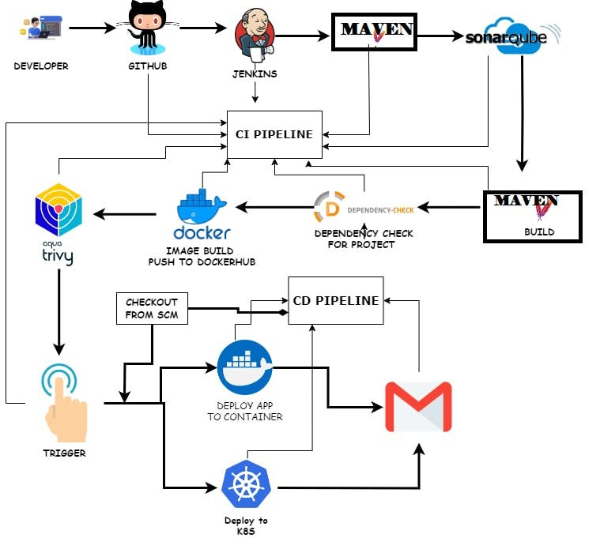

## Installation de Jenkins

L'installation se fait avec les commandes ci-dessous. Celles-ci sont regroupées dans le fichier `jenkins.sh`.

### Créer le fichier `jenkins.sh` et y insérer le code ci-dessous.

```shell
#!/bin/bash
sudo apt update -y
wget -O - https://packages.adoptium.net/artifactory/api/gpg/key/public | tee /etc/apt/keyrings/adoptium.asc
echo "deb [signed-by=/etc/apt/keyrings/adoptium.asc] https://packages.adoptium.net/artifactory/deb $(awk -F= '/^VERSION_CODENAME/{print$2}' /etc/os-release) main" | tee /etc/apt/sources.list.d/adoptium.list
sudo apt update -y
sudo apt install temurin-17-jdk -y
/usr/bin/java --version
curl -fsSL https://pkg.jenkins.io/debian-stable/jenkins.io-2023.key | sudo tee \
                  /usr/share/keyrings/jenkins-keyring.asc > /dev/null
echo deb [signed-by=/usr/share/keyrings/jenkins-keyring.asc] \
                  https://pkg.jenkins.io/debian-stable binary/ | sudo tee \
                              /etc/apt/sources.list.d/jenkins.list > /dev/null
sudo apt-get update -y
sudo apt-get install jenkins -y
sudo systemctl start jenkins
sudo systemctl status jenkins
```

### Exécuter l'installation

```shell
sudo chmod 777 jenkins.sh 
./jenkins.sh
```
> Le port utilisé par défaut par Jenkins est le 8080, dans le cadre de cet exercice, nous allons le changer pour le port 8090 car l'application sera exposée sur le port 8080

### Modification du port Jenkins

Pour modifier le port de Jenkins, il s'agit de modifier des fichiers de configuration dans les fichiers `/etc/default/jenkins` et `/lib/systemd/system/jenkins.service`.

1. Arrêter le service Jenkins : `sudo systemctl stop jenkins`
2. Vérifier que Jenkins est bien arrêté : `sudo systemctl status jenkins`
3. Modifier la valeur de la ligne `HTTP_PORT=` à 8090 dans `/etc/default/jenkins`
4. Modifier la valeur du port `Environments="Jenkins_port=` à 8090 dans /`lib/systemd/system/jenkins.service`
5. Redémarrer le daemon systemctl : `sudo systemctl daemon-reload`
6. Redémarrer le service Jenkins : `sudo systemctl restart jenkins`
7. Vérifier que Jenkins est bien démarré : `sudo systemctl status jenkins`

### Première connexion à Jenkins

#### Pour se connecter à Jenkins, ouvir l'URL : 
`http://<IP publique de la VM>:8090`

#### Récupérer le mot de passe admin : 
`sudo cat /var/lib/jenkins/secrets/initialAdminPassword`

#### Installer les plugins suggérés :

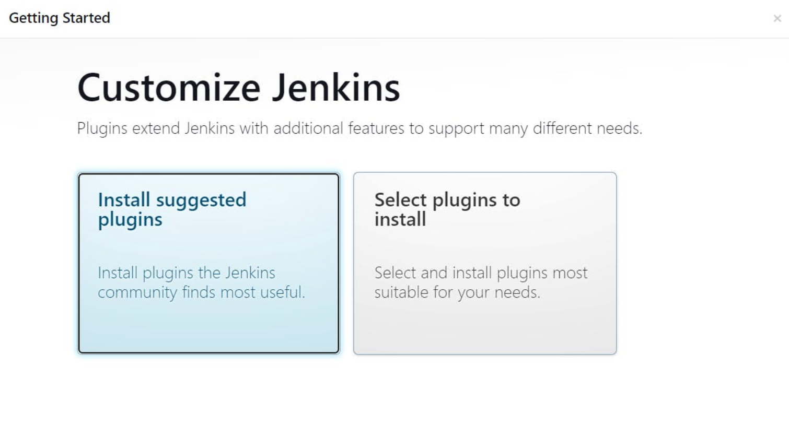

#### Créer un utilisateur admin


#### Bravo vous êtes connecté à Jenkins !


## Installation de SonarQube

SonarQube est un outil SAST qui permet l'analyse de sécurité du code. SonarQube est exécutée sous forme de conteneur.

```shell
docker run -d --name sonar -p 9000:9000 sonarqube:lts-community
```

Une fois le conteneur déployé, vérifier qu'il est bien démarré et en état running

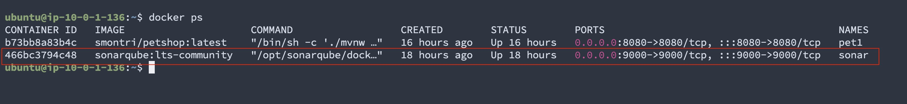

### Connnexion à SonarQube

`http://<IP publique de la VM>:9000`

Les credentials à utiliser pour la première connexion sont `admin/admin`.

> SonarQube vous demande de modifier le mot de passe admin

Voici la console de SonarQube :


## Défintion des étapes du pipeline

### Etape 1 - Maven

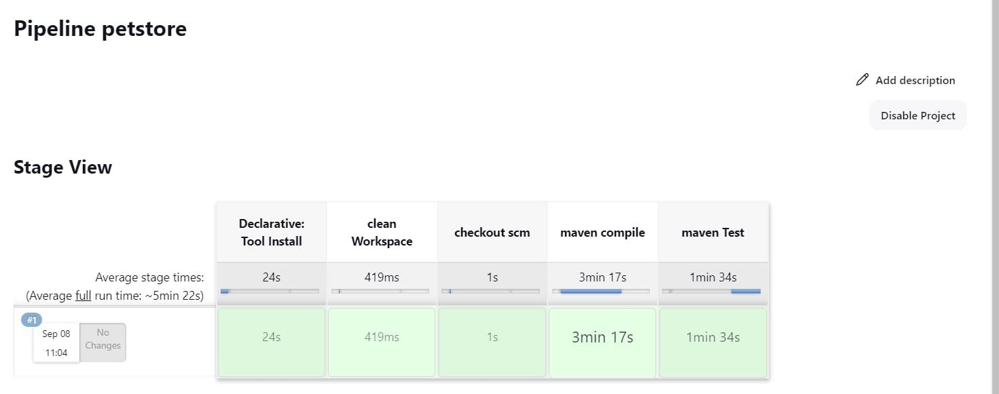

#### Installation de plugins (installation sans redémarrage)

👉 Eclipse Temurin Installer 

👉 SonarQube Scanner

#### Configuration des plugins

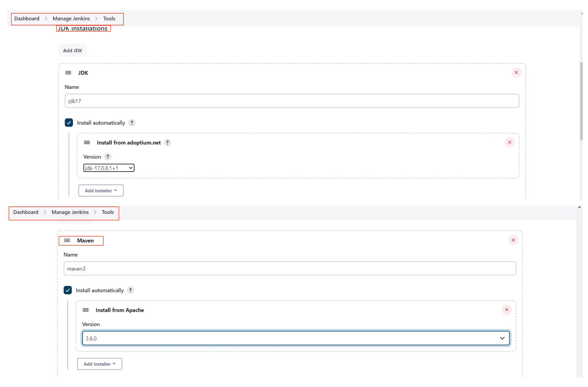

#### Création du job

Créer un item dans Jenkins de type `Pipeline` que vous pouvez nommer `petstore`

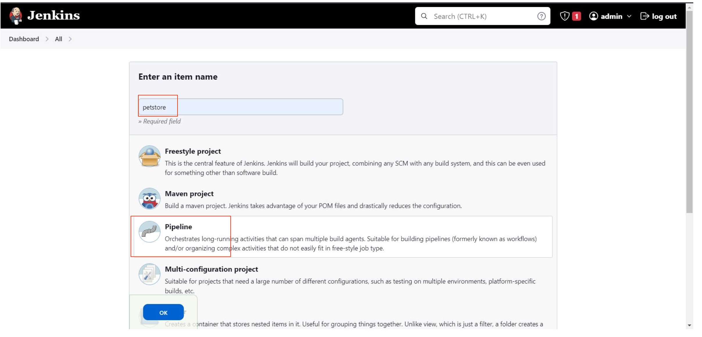

Et utiliser le code ci-dessous pour définir le pipeline ;

```jenkinsfile
pipeline{
    agent any
    tools {
        jdk 'jdk17'
        maven 'maven3'
    }
    stages{
        stage ('clean Workspace'){
            steps{
                cleanWs()
            }
        }
        stage ('checkout scm') {
            steps {
                git 'https://github.com/smontri/jpetstore-6.git'
            }
        }
        stage ('maven compile') {
            steps {
                sh 'mvn clean compile'
            }
        }
        stage ('maven Test') {
            steps {
                sh 'mvn test'
            }
        }
   }
}
```

> Attention à bien utiliser le fork du repo `jpetstore-6`, que vous avez fait avant de démarrer, dans le stage `checkout scm`.


### Etape 2 - Analyse SonarQube

#### Création d'une token 

Il s'agit de créer une token pour l'utilisateur SonarQube qui sera utilisée par Jenkins pour invoquer SonarQube dans le pipeline.

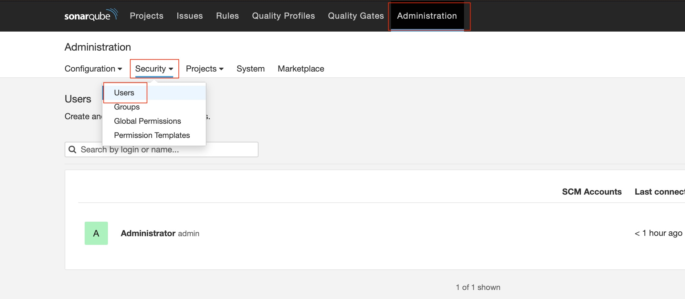

Cette token doit ensuite être utilisée pour configurer les credentials Sonar dans Jenkins.

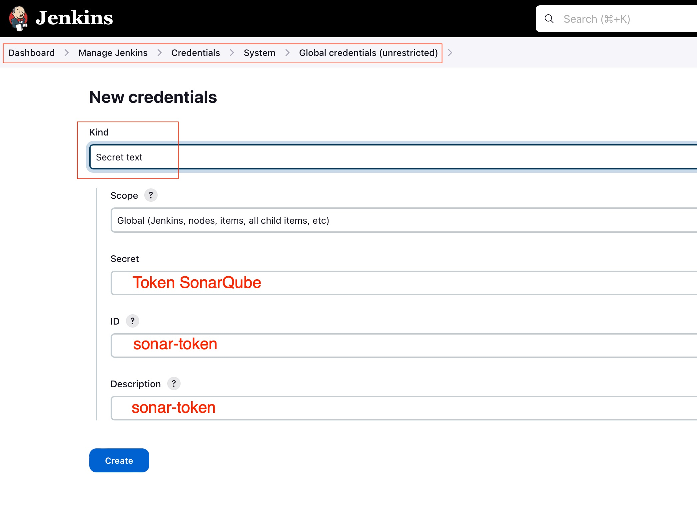

> **ID** = sonar-token
> 
> **Description** = sonar-token

#### Configuration du serveur Sonar

Dans Jenkins - Manage Jenkins -> System, configurer le serveur SonarQube comme ci-dessous.

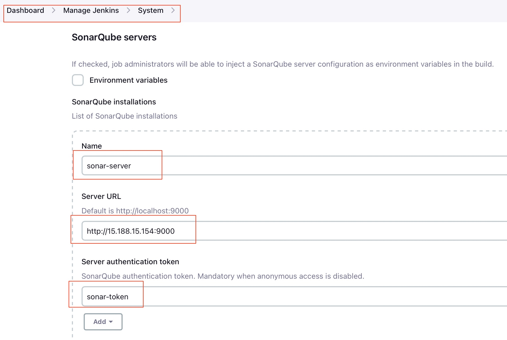

#### Configuration du scanner Sonar

Dans Jenkins - Manage Jenkins -> Tools, ajouter un scanner pour SonarQube

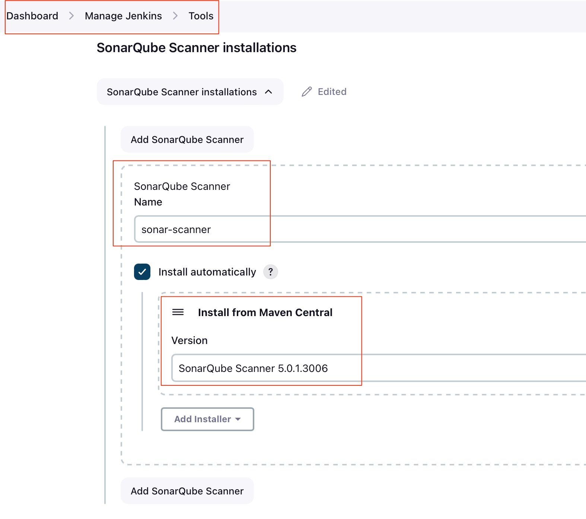

#### Ajout d'une quality gate dans SonarQube

Il s'agit de configurer un webhook dans SonarQube pour récupérer les informations dans la console Jenkins.

Depuis la console SonarQube :

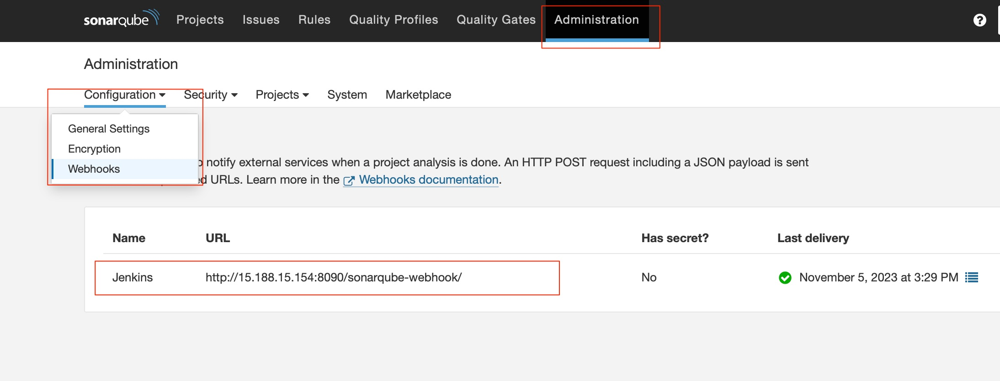

**Name** : `Jenkins`

**URL** : `<http://IP Jenkins:8090>/sonarqube-webhook/`

#### Modification de la définition du pipeline

Nous allons ajouter 2 étapes au pipeline ainsi que des informations d'environnement pour l'utilisation du scanner SonarQube.

* Environnement du scanner, à ajouter sous la section `tools`
 
```
environment {
        SCANNER_HOME=tool 'sonar-scanner'
    }
```

* Ajout des étapes du pipeline, à ajouter en fin de liste des `stages`

```
stage("Sonarqube Analysis "){
            steps{
                withSonarQubeEnv('sonar-server') {
                    sh ''' $SCANNER_HOME/bin/sonar-scanner -Dsonar.projectName=Petshop \
                    -Dsonar.java.binaries=. \
                    -Dsonar.projectKey=Petshop '''
                }
            }
        }
        stage("quality gate"){
            steps {
                script {
                  waitForQualityGate abortPipeline: false, credentialsId: 'Sonar-token' 
                }
           }
        }
```

Le pipeline doit, à présent, ressembler à ceci :


Et vous pouvez consulter le résultat de l'analyse SonarQube dans la console :

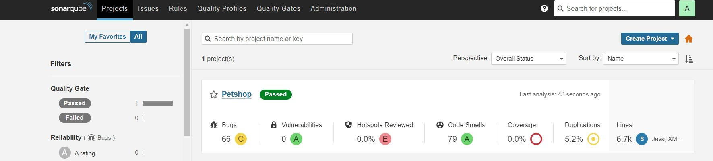

### Etape 3 - Analyse des dépendances OWASP

Pour effectuer cette analyse, on s'appuie sur un plugin Jenkins `OWASP Dependency check`.

A installer via Manage Jenkins -> Plugins


