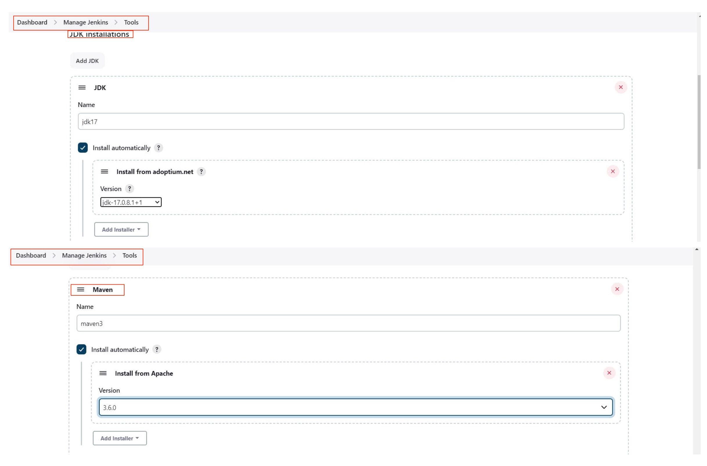

# Temurin

Configurer le plugin comme indiqué ci-dessous, via le menu `Manage Jenkins ⇒ Tools` dans Jenkins.


<mark style="color:red;">**Attention à bien respecter les versions de JDK et de Maven**</mark>


<figure><figcaption></figcaption></figure>

<figure><figcaption></figcaption></figure>
