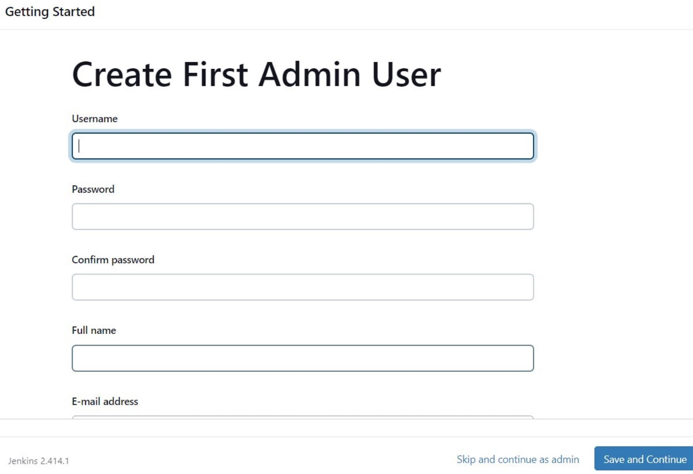

# Installation de Jenkins

## Préparation de l'installation

Créer un fichier `jenkins.sh` et y insérer le code ci-dessous

```shell
#!/bin/bash
sudo apt update -y
wget -O - https://packages.adoptium.net/artifactory/api/gpg/key/public | tee /etc/apt/keyrings/adoptium.asc
echo "deb [signed-by=/etc/apt/keyrings/adoptium.asc] https://packages.adoptium.net/artifactory/deb $(awk -F= '/^VERSION_CODENAME/{print$2}' /etc/os-release) main" | tee /etc/apt/sources.list.d/adoptium.list
sudo apt update -y
# sudo apt install temurin-17-jdk -y
sudo apt install openjdk-17-jdk -y
/usr/bin/java --version
curl -fsSL https://pkg.jenkins.io/debian-stable/jenkins.io-2023.key | sudo tee \
                  /usr/share/keyrings/jenkins-keyring.asc > /dev/null
echo deb [signed-by=/usr/share/keyrings/jenkins-keyring.asc] \
                  https://pkg.jenkins.io/debian-stable binary/ | sudo tee \
                              /etc/apt/sources.list.d/jenkins.list > /dev/null
sudo apt-get update -y
sudo apt-get install jenkins -y
sudo systemctl start jenkins
sudo systemctl status jenkins
```

## Installation

```shell
sudo chmod 777 jenkins.sh 
./jenkins.sh
```

## Modification du port Jenkins

> Le port utilisé par défaut par Jenkins est le 8080, dans le cadre de cet exercice, nous allons le changer pour le port 8090 car l'application finale sera exposée sur le port 8080

Pour modifier le port de Jenkins, il s'agit de modifier les fichiers de configuration suivants :

* `/etc/default/jenkins`&#x20;
* `/lib/systemd/system/jenkins.service`

1. Arrêter le service Jenkins : `sudo systemctl stop jenkins`
2. Vérifier que Jenkins est bien arrêté : `sudo systemctl status jenkins`
3. Dans le fichier `/etc/default/jenkins`Modifier la valeur de la ligne `HTTP_PORT=` à <mark style="color:red;">8090</mark>&#x20;
4. Dans le fichier `/lib/systemd/system/jenkins.service` modifier la valeur du port `Environments="Jenkins_port=` à <mark style="color:red;">8090</mark> &#x20;
5. Redémarrer le daemon systemctl : `sudo systemctl daemon-reload`
6. Redémarrer le service Jenkins : `sudo systemctl restart jenkins`
7. Vérifier que le service Jenkins est bien démarré : `sudo systemctl status jenkins`

## Connexion à Jenkins

L'accès à la console Jenkins se fait via l'URL ci-dessous :

`http://`_<mark style="color:red;">`<IP publique de la VM>`</mark>_`:8090`

Lors de la prmière connexion à Jenkins, utiliser le mot de passe Admin initial qui est stocké dans le fichier : `/var/lib/jenkins/secrets/initialAdminPassword`

## **sds**

## **Installer les plugins suggérés**


### **Créer un utilisateur admin**



### **Bravo vous êtes connecté à Jenkins !**

<figure><figcaption></figcaption></figure>
